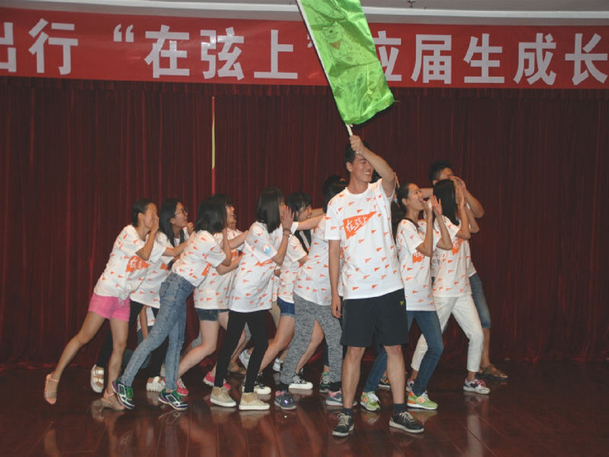

###Preface:

2015.8.1~2015.8.9 作为滴滴新入职的应届生一枚，参加为期9天的“在弦上”活动，结识了不少朋友，感触良多。   


##在弦上

今年是滴滴第一年校招，“在弦上”也就是第一季，作为试水的小白鼠，玩得还是挺开心的，多亏hr团队的海檬和嘉忆老师的辛苦付出和周密准备   
9天集训的构成：   

```
┌─ .
│
├─ 户外拓展 2天
│	   │
│      ├─ 高空跨板，造桥，扫雷，七巧板
│	   │   
│	   └─ 盲人方阵，极速60s，盲人岛 etc
│ 
├─ 技术培训 3天
│	   │
│      ├─ 互联网xxx，程序员xxx，项目xxx
│	   │
│	   ├─ 分布式xxx，网络xxx，RPC xxx
│	   │
│	   └─ redis，mysql，golang，unit-testing，code-style
│
├─ 实战 IRC 3天
│	   │
│	   └─ 聊天工具
│
└─  on the way ...
```

### 户外拓展

和来自杭州上海快的团队的小伙伴们玩的很开心。其实一开始，我是拒绝的。性格问题，多少有点放不开。   

拓展的目的大概就是为了培养团队意识，并在其固有思维上有所启发，我来谈谈自己get到的点：   

* 思维定式，拘泥于规则
* 团队分工及自我定位
* 团队合作中的有效沟通
* 再多一次，有效尝试

<figure class="half">
	<a href="../images/on_the_string/1.jpg">
		
	</a>
	<a href="../images/on_the_string/2.jpg">
		
	</a>
	<figcaption>娘子军</figcaption>
</figure>


###  技术培训


 
