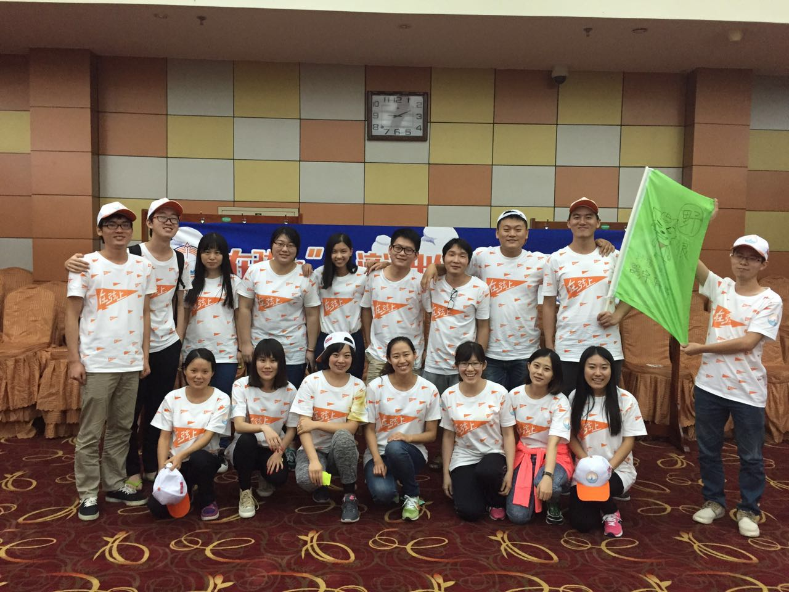

##Preface:

2015.8.1~2015.8.9 作为滴滴新入职的应届生一枚，参加为期9天的“在弦上”活动，结识了不少朋友，感触良多。   


##在弦上

今年是滴滴第一年校招，“在弦上”也就是第一季，作为试水的小白鼠，玩得还是挺开心的，多亏hr团队的海檬和嘉忆老师的辛苦付出和周密准备。9天集训的构成：   

```
┌─ .
│
├─ 户外拓展 2天
│	   │
│	   ├─ 高空跨板，造桥，扫雷，七巧板
│	   │   
│	   └─ 盲人方阵，极速60s，盲人岛 etc
│ 
├─ 技术培训 3天
│	   │
│	   ├─ 互联网xxx，程序员xxx，项目xxx
│	   │
│	   ├─ 分布式xxx，网络xxx，RPCxxx
│	   │
│	   └─ redis，mysql，golang，unit-testing，code-style
│
├─ 实战IRC 3天
│	   │
│	   └─ 聊天工具
│
└─  on the way ...
```

<br>
### 户外拓展
跟来自杭州、上海快的团队的小伙伴们玩的很开心。   
其实一开始，我是拒绝的。性格问题，多少有点放不开。   
拓展的目的大概就是为了培养团队意识，并在其固有思维上有所启发。   
我来谈谈自己get到的点：   

* 思维定式，拘泥于规则   
* 团队分工及自我定位   
* 团队合作中的有效沟通   
* 再多一次，有效尝试   

<figure class="half">
	<a href="../images/on_the_string/1.jpg">
		
	</a>
	<a href="../images/on_the_string/2.jpg">
		
	</a>
	<figcaption>野狼队 && 娘子军</figcaption>
</figure>

哭过，累过，笑过，野狼队是最棒的   

<br>
###  技术培训

从内容上看，一部分是比较基础的，一部分是偏后端架构的，个人感觉稍微有点抵触 <del>新语言、技术</del> ，这种心态很<span style="color:red">危险</span>！   
从老师上看，请来的老师都是产品技术部的架构大牛和项目顾问，阵容十分强大，但是感觉到自己底子比较差，不少东西还是跟不上，严重地讲，大致就是上面讲得眉飞色舞，我却在下面迷糊神游，有点自暴自弃，这种状态很<span style="color:red">危险</span>唉。   
到写这篇博客，已经过去十多天了，该忘的都忘了，不该忘的也差不多忘了，列些还有感觉的点：   

* 解耦   
* 小步快跑，持续集成   
* 代码规范，写给人还是机器看   

(当然还有一些技术上的收获，这里只罗列一些思想)   

<figure>
	<a href="../images/on_the_string/3.jpg">
		
	</a>
	<figcaption>我最年轻，我最2</figcaption>
</figure>

### 项目实战IRC

```
Team : EasyGo   
Members : 
	XiaoJing          Server
	WeiDidi           Parser
	ZhangHaolong      Redis
	ZhuXimei          Testing
	LiuJian           Android
	ShiYuan            Web
```

3天时间，实现一个能多人分组聊天的工具，限定条件是后端必须用Go语言。这明摆着是要拼后端呀，我们组三个架构，两个算法，一个安卓，于是后端我完全插不上手，默默搞web去了。   
结果咧，队友十分给力，我们组拿了冠军~   

<figure>
	<a href="../images/on_the_string/4.jpg">
		
	</a>
	<figcaption>小桔人民很行</figcaption>
</figure>
 
 
我们组由于人员比较充足，做了三个客户端，一个cmd，一个安卓，一个web。让一个搞算法的搞web，画面是该有多美   
 
<figure>
	<a href="../images/on_the_string/5.jpg">
		
	</a>
	<figcaption>酷炫吧~</figcaption>
</figure>

我们是最牛逼的   

<figure class="third">
	<a href="../images/on_the_string/9.jpg">
		
	</a>
	<a href="../images/on_the_string/10.jpg">
		
	</a>
	<a href="../images/on_the_string/11.jpg">
		
	</a>
</figure>


好歹也是看过凌晨五点滴滴打车的人   

<figure class="third">
	<a href="../images/on_the_string/6.jpg">
		
	</a>
	<a href="../images/on_the_string/7.jpg">
		
	</a>
	<a href="../images/on_the_string/8.jpg">
		
	</a>
</figure>

好了，秀得差不多了，该反省一下了：   

* 被吐槽的代码风格   
* 自以为解耦，先后不一致，导致集成造成困难   
* 有效沟通和方法统一。当我们把数据以JSON串的格式定下来后，效率就上去了   
* 过分肯定。对自己的代码过于放心，对依赖的模块过于相信，都不是一种好的开发者心态   
* 这是一个试错的年代，永远不要只站在一个角度上评估一件事、一个人的价值   

<figure>
	<a href="../images/on_the_string/12.jpg">
		
	</a>
	<figcaption>这是滴滴的新动力</figcaption>
</figure>

### 项目分享   

先分享一个坑：   
为了增加炫酷效果，我们决定用脸萌的头像作为聊天头像。但是为了保证用户每次登陆时头像保持一致，我加了根据username产生随机脸萌头像链接的函数，然后页面加载不出来了。这个问题我和刘健基本上搞到天亮才发现，原来是js对数组越界的处理不明显，越界了浏览器也不给个报错提示，就自己在那转啊转的。其实这只是个小坑，大坑呢，大坑就是一个通宵，我没在git上提交过一次代码，更没有去做备份，导致当初就不知道它为啥挂了，是加了哪行代码的原因，就特么突然一下就加载不出来了，然后接着乱搞了两三个小时。这是一个解释"小步快跑"好处的，活生生的例子。   

再分享一个坑：   
Server端给Web端返回的是一个静态的html，所以我所有的代码都放在一个纯文本中，所有功能都得用js来实现。我把登录框和聊天界面放在同一个页面，通过检查登录状态来显示登录还是聊天。   
<span style="color:red">偷懒</span>，用了一个很齪的方法：登录的时候写cookie,然后<span style="red">刷新</span>,通过检测cookie来决定是否显示聊天框。哎哟妈呀，这方法太sb了，坑哭了。   
通过url访问Web端的时候会建立一个Websocket连接，我中途做了一个<span style="color:red">刷新</span>操作，就产生了一个新的WebSocket，原来的那个链接关闭了，新的却成了野指针，T_T。   

最后分享一件夺冠后的事：   
8.9 项目验收时，由于肖京和我的版块集成失败，Web端的WebSocket没能跟Server端的Socket连通，WebSocket是指针，而Socket不是，所以演示效果时只是Web与Web聊天，安卓与cmd可以聊天。尽管是这样有瑕疵的作品，我们还是拿到了冠军   
8.11 大家都各自回到工作岗位上，搬砖、写报告。肖京在群里跟我们说，WebSocket和Socket可以连通了   
8.14 肖京和我，各自修改了代码，最后集成成功，并更新最终代码   
其实，一开始，我是懒得再看这份代码的   
可是，后来，我们还是为自己的代码负责到底   
我想，大概，小桔人民都是这样的靠谱吧   

